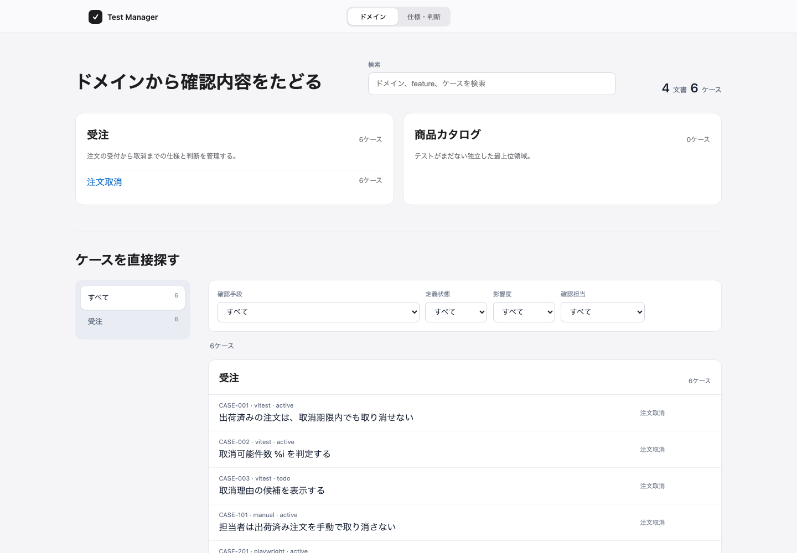
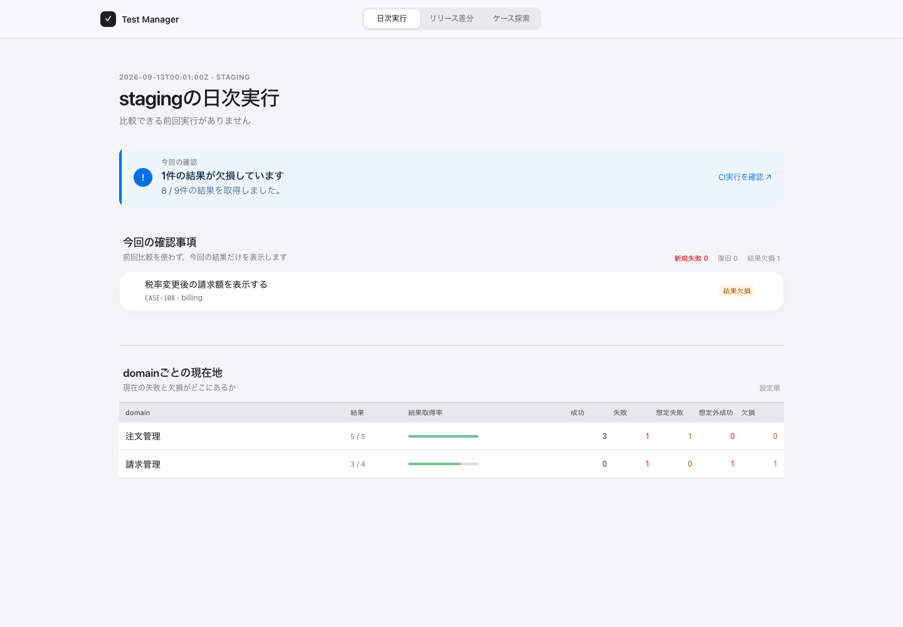
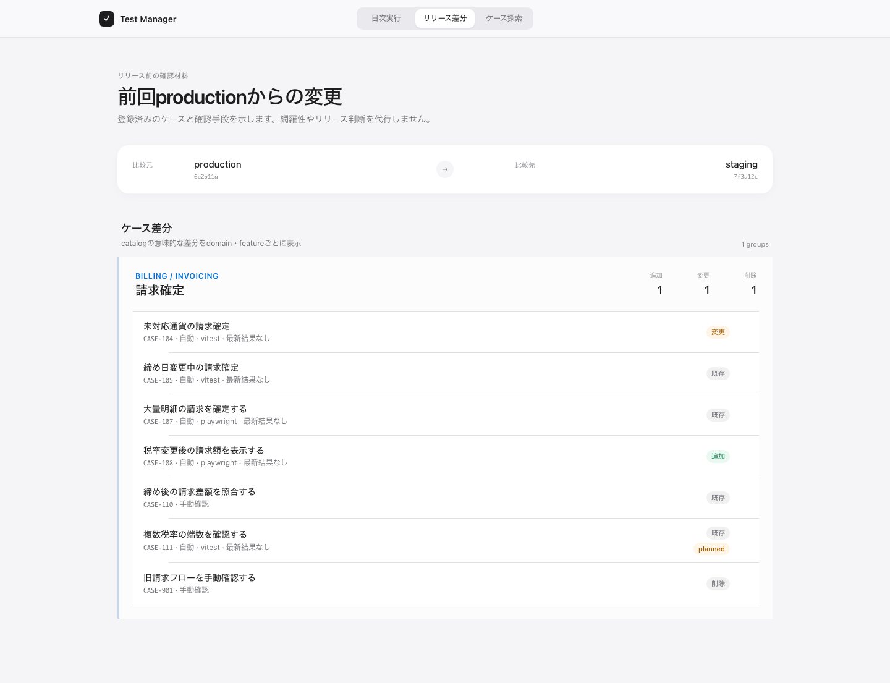

# test-manager

テストコード、手動テスト、仕様・判断文書を、実行せずに一つのカタログへまとめる CLI です。

プロジェクト内に散らばった Vitest、Playwright、Storybook、手動ケースを静的解析し、「このテストはどの仕様に属するか」「参照先が消えていないか」「必要な分類が記録されているか」を検査します。検査済みの情報から、domainを入口に仕様・判断をたどる画面と、ケースを複数語検索や分類で絞り込む画面を生成できます。

カタログ画面は検証済みcatalogを純粋なTypeScript rendererへ渡して静的HTMLへ変換します。CLI実行時にWebフレームワークを起動せず、持ち運べる生成物をtest-managerのmanaged output境界から公開します。



test-manager はテストランナーそのものではありません。runner reporterが出力した事実をCI manifestと統合し、テスト定義と実行結果を日次・リリース差分画面へ接続します。

## 品質ダッシュボード

実行結果をカタログへ照合し、日次実行とリリース差分を生成できます。画面が示すのは登録済みケース・取得済み結果・catalog差分の事実であり、網羅性やリリース可否は判定しません。[承認済みUIプロトタイプ](prototypes/quality-dashboard/index.html) と [利用場面・画面設計](docs/quality-dashboard-design.md) を参照してください。

### 日次実行

CI開始前に確定したmanifestと、Vitest・Playwright reporterが生成したunit artifactを一つの`TestRun`へ統合します。成功・失敗だけでなく、想定失敗、想定外成功、skip、retry成功、timeout、結果欠損、runnerの途中終了を区別して表示します。比較対象は同じenvironment・scopeの前回runに限定し、条件が異なる場合は比較不能と表示します。



### リリース差分

前回production commitと現在のstaging commitで生成したcatalog snapshotを比較し、追加・変更・削除されたケースをdomain・feature単位に表示します。自動テストは任意でstagingの最新結果を添え、手動ケースは確認手段としてそのまま示します。



## 想定する使い方

たとえば、ある仕様に対して単体テスト、E2E、Storybook、手動確認が存在するとします。それぞれへ同じ `belongsTo` と固有のケース ID を付けると、test-manager は次を行います。

1. 設定した glob から仕様・判断文書とテスト定義を探す
2. ソースコードを実行せず、対応する宣言だけを AST で読み取る
3. ID の重複、参照切れ、親子関係、必須項目、分類語彙を検査する
4. 仕様・判断文書と全テストケースを横断できる静的サイトと `catalog.json` を生成する

CI では `check` を実行して、不整合のある変更を検出できます。人が仕様やテストを調べるときは、`build` したサイトから、領域・情報源・状態・プロジェクト独自の分類でケースを探せます。

## 試す

現在はリポジトリから実行します。

```sh
pnpm install --frozen-lockfile
pnpm build

node dist/cli.js check --config fixtures/valid/test-manager.yaml
node dist/cli.js build \
  --config fixtures/valid/test-manager.yaml \
  --out /tmp/test-manager-site

node dist/cli.js daily \
  --config fixtures/quality-dashboard/test-manager.yaml \
  --manifest fixtures/quality-dashboard/manifest.json \
  --completed-at 2026-09-13T00:01:00Z \
  --unit-artifact fixtures/quality-dashboard/vitest.test-manager-unit.json \
  --unit-artifact fixtures/quality-dashboard/playwright.test-manager-unit.json \
  --stylesheet prototypes/quality-dashboard/assets/dashboard.css \
  --out /tmp/test-manager-daily
```

`check` は検査成功時に `0`、診断がある場合に `1`、CLI の使い方が不正な場合に `2` を返します。`build`、`daily`、`snapshot`、`release` は入力検査成功後だけ、test-manager所有マーカーを持つ安全な出力ディレクトリへ生成します。

リリース差分では、productionとstagingの各checkoutで `snapshot --config <path> --commit <sha> --out <path>` を実行します。その `release-catalog.json` 2件を `release --production-snapshot <path> --staging-snapshot <path> --stylesheet <path> --out <path>` へ渡します。stagingの実行事実も表示する場合は、同じcommit・`staging`環境のrunを `--latest-staging-run` で指定します。

manifestにはrun ID、attempt、environment、commit、scope、開始時刻、HTTP(S)のCI URL、実行予定unitとcase IDだけを記録します。GitHub Actions context全体や機密情報は保存しません。unit artifactが生成されなかった場合は`artifactMissing`、runnerが結果を残して途中終了した場合は`runnerError`などのincomplete理由として扱い、両者を混同しません。attachmentは設定したartifact root内だけを許可し、相対参照として保存します。

## プロジェクトへ設定する

プロジェクトのルートなどに `test-manager.yaml` を作ります。glob の基準は、この設定ファイルが置かれたディレクトリです。

```yaml
version: 1
idPattern: "^(?:[a-z][a-z0-9-]*|CASE-[0-9]{3})$"

discovery:
  documents: ["knowledge/**/*.md"]
  manualCases: ["knowledge/**/*.manual.yaml"]
  sources:
    - kind: vitest
      paths: ["src/**/*.test.ts"]
    - kind: playwright
      paths: ["journeys/**/*.spec.ts"]
    - kind: storybook
      paths: ["src/**/*.stories.tsx"]

documents:
  kinds:
    domain:
      description: 業務領域
      parent: { required: false, targetKinds: [] }
    feature:
      description: domainに属する機能
      parent: { required: true, targetKinds: [domain] }
    decision:
      description: 判断や制約
      parent: { required: true, targetKinds: [feature] }
  displayOrder:
    domain: [orders, billing, scheduling]
    feature: [order-cancellation]

case:
  fields:
    belongsTo:
      type: reference
      targetKinds: [domain, feature]
      placement: classification
      required: true
    refs:
      type: reference-list
      targetKinds: [domain, feature, decision]
      placement: classification
      required: false
      uniqueItems: true
    impact:
      label: 影響度
      type: integer-enum
      placement: classification
      required: true
      values:
        1: { label: 限定的, description: 影響が限定的 }
        2: { label: 主要操作, description: 主要操作に影響する }
        3: { label: 主要業務, description: 主要な利用目的を阻害する }
    reason:
      type: text
      placement: detail
      required: false
```

### discovery

どのファイルを読み取るかを指定します。

- `documents`: YAML frontmatter を持つ Markdown
- `manualCases`: 1 ファイルに 1 ケースを記述した YAML
- `sources`: `vitest`、`playwright`、`storybook` と、それぞれの glob

設定した glob が 1 件も見つからない場合や、一つのファイルが複数の設定に重複して一致した場合は診断します。

### documents.kinds

仕様・判断文書の種類と、許可する親子関係を定義します。`parent.required` で親の必須性を、`targetKinds` で親として許可する種類を指定します。

`documents.displayOrder` には、kindごとの安定した表示順を指定できます。実行結果によって順序は変わらず、一覧上の位置を保ちます。列挙していない文書は、指定済み文書の後ろへID順で表示します。存在しないID、kindが異なるID、重複したIDは設定エラーです。

### case.fields

プロジェクトで各ケースに記録する項目を定義します。フィールド名は固定されていませんが、`belongsTo` は必須の参照項目です。

利用できる型は `reference`、`reference-list`、`enum`、`integer-enum`、`text`、`text-list` です。`required`、条件付き必須の `requiredWhen`、`minItems`、`uniqueItems` も設定できます。安定した英語のfield keyやenum valueを変えずに、任意の`label`で画面上の日本語表示名を指定できます。

`placement` は記述場所とサイト上での扱いを決めます。

- `classification`: `@case` に記述し、一覧の絞り込みに使う項目
- `detail`: `@case-doc` に記述する条件や理由などの詳細

設定に未知のキー、矛盾した必須条件、存在しない文書 kind への参照がある場合は、起動時に拒否します。

## 仕様・判断とケースを記述する

### 仕様・判断文書

Markdown 先頭の YAML frontmatter に、ID、種類、タイトル、任意の親と関連文書を記述します。

```md
---
id: order-cancellation
kind: feature
title: 注文キャンセル
parent: orders
---

注文キャンセルに関する判断と制約を管理します。
```

文書 ID の重複、存在しない親・関連文書、許可されていない親 kind、親関係の循環を検出します。

### Vitest

`@case` をテスト宣言の直前に置き、ケース ID を `meta.caseId` に記述します。条件や理由が必要なら、callback 冒頭の `@case-doc` に記述します。

```ts
/**
 * @case
 * belongsTo: order-cancellation
 * refs: [cancellation-policy]
 * impact: 3
 */
it(
  '期限を過ぎた注文をキャンセルできない',
  { meta: { caseId: 'CASE-001' } },
  () => {
    /**
     * @case-doc
     * reason: 確定済みの出荷処理と矛盾させないため
     */
    // test body
  },
);
```

プロジェクトで `meta.caseId` を型安全に使う場合は、Vitest の metadata を拡張します。

```ts
import '@vitest/runner';

declare module '@vitest/runner' {
  interface TaskMeta {
    caseId?: string;
  }
}
```

### Playwright

ケース ID は `case-id` annotation に記述します。

```ts
/**
 * @case
 * belongsTo: order-cancellation
 * impact: 3
 */
test(
  '期限切れの表示ではキャンセル操作が無効になる',
  {
    annotation: { type: 'case-id', description: 'CASE-201' },
  },
  async () => {
    // test body
  },
);
```

### Storybook

Story の明示的な `name` の先頭へケース ID を入れます。

```ts
/**
 * @case
 * belongsTo: order-cancellation
 * impact: 2
 */
export const Disabled = {
  name: '[CASE-301] キャンセルできない状態',
};
```

### 手動ケース

1 YAML ファイルに 1 ケースを記述します。`steps` は操作と期待結果の組です。

```yaml
id: CASE-101
title: オペレーターが期限切れの注文をキャンセルできない
belongsTo: order-cancellation
impact: 3
steps:
  - action: 期限切れの注文を開く
    expected: キャンセル操作が無効である
```

実施結果の入力欄はありません。手動ケースも「何を確認するか」の定義として扱います。

## CI で検査する

依存関係のインストールとビルド後に `check` を実行します。

```sh
node dist/cli.js check --config ./test-manager.yaml
```

診断はファイル、行、列、診断コード、対象、理由を含みます。たとえば、ケースの belongsTo が存在しない、ID が重複している、必須項目が欠けている、といった変更をマージ前に検出できます。

## 静的解析の対応境界

対応するのは、各ランナーから直接 import した標準宣言、静的文字列タイトル、object literal の options、inline 配列リテラルの `each`、object literal の Story です。

動的タイトル、動的 each、独自 wrapper、外部データからの生成、Story factory は、診断対象または対象外として明示します。対象ソースを実行して推測することはありません。

ツールが検査するのは構造的な整合性です。ケース名が確認内容を正しく表しているか、条件・理由が十分か、実装と記述が意味的に一致しているかは、人がレビューします。

## 出力の安全性と再現性

- Markdown 本文とソース断片は HTML として実行せず、エスケープして表示します
- 生成物には生成日時や絶対パスを含めません
- プロジェクトルートと、その祖先への出力を拒否します
- test-manager の marker がない既存ディレクトリは置換しません
- 同じ入力からは同じファイルツリーを生成します
